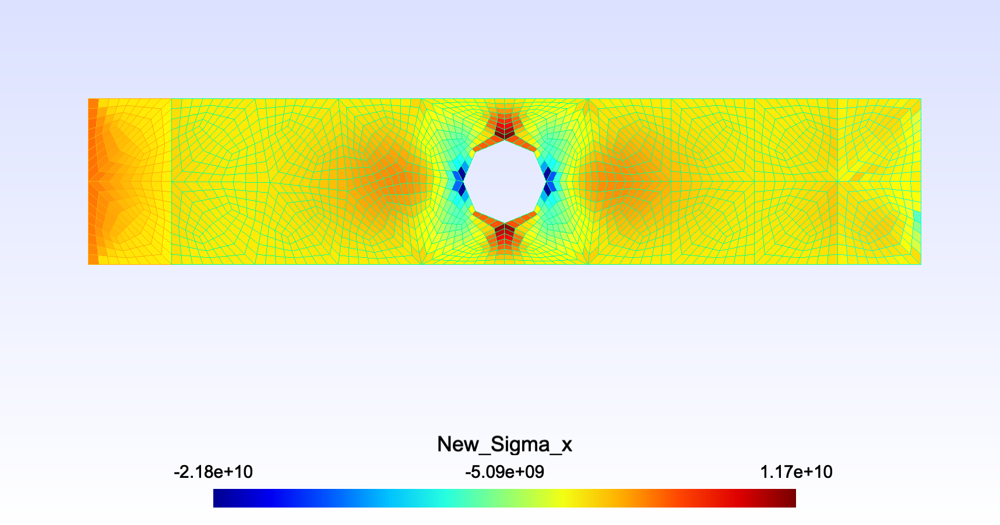

# FE2021-HW3
# PART 1
## Mesh

## Geometry

## New Mesh

## Displacements

## Sigma X

# PART 2

### Nodal stress averaging post-processing:

To calculate the stresses, extrapolation from Gauss Points was used, in this method the stresses at the Gauss points are evaluated and then extrapolated to the corners of the quadrilateral element where the nodes are.

First, the natural coordinates of each element were obtained, these being:

Once these coordinates are obtained, we can obtain N1, N2, N3 and N4, using the following equations:

With these values, we can assemble the matrix N of 4x4, which is as follows.

Finally, the equation ω = N∙ω' will be used, where ω' is equal to (σxx,σyy,σxy,εxy), previously calculated.

## Coarse mesh stress

## Coarse mesh stress with nodal stress averaging post-processing

## Medium mesh stress

## Medium mesh stress with nodal stress averaging post-processing

## Fine mesh stress

## Fine mesh stress with nodal stress averaging post-processing

The difference between both methods is quite noticeable in the plots that can be seen above. This is because the methods for obtaining stresses from displacements tend to be less accurate. In addition, the Nodal stress averaging post-processing method is usually more accurate, so it can be assumed that the results obtained by this method are closer to reality.

# PART 3

The quad9 element is a 2-dimensional quadrilateral element that is made up of 9 nodes, unlike the quad4 element, which is made up of only 4. Despite this difference, quad9 works in the same way as quad4 does, but with arrays of different dimensions, due to the increased number of nodes.
Quad9 type elements can be very useful, since by presenting a greater number of nodes, they can describe curves, and the stiff behavior of quad4 elements is avoided.

For both quad9 and quad4, 3 different meshes were created, a fine (h = 0.25), a medium (h = 0.5) and a thick (h = 1).
### Maximum absolute stresses quad4

### Maximum absolute stresses quad9

As can be seen in the plots above, in both cases the stresses decrease as the size of the mesh increases. However, with quad4 elements, when going from fine mesh to medium mesh, the stresses decrease more quickly than with quad9. However, when going from the medium mesh to the coarse mesh, the stresses decrease with the same slope in both cases.

Quad4 has higher absolute stresses than Quad9, this may be due to the fact that quad9 better models the deformation of the element, which results in lower stresses.
With quad4 elements, the best results are obtained with thicker meshes, since this element is very stiff in some cases.
