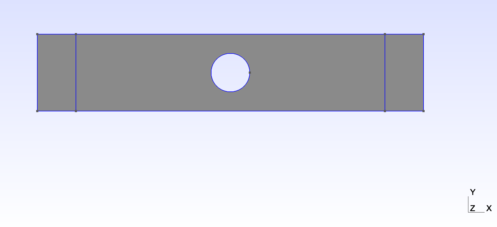
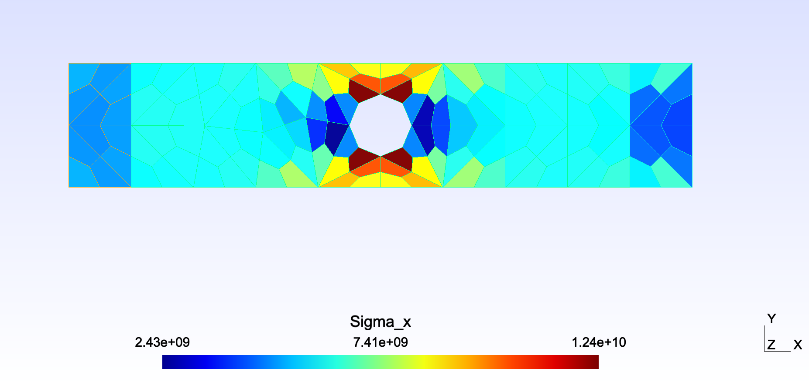

# FE2021-HW3
# PART 1
## Mesh

## Geometry

## New Mesh

## Displacements

## Sigma X

# PART 2

### Nodal stress averaging post-processing:

To calculate the stresses, extrapolation from Gauss Points was used, in this method the stresses at the Gauss points are evaluated and then extrapolated to the corners of the quadrilateral element where the nodes are.

First, the natural coordinates of each element were obtained, these being:

Once these coordinates are obtained, we can obtain N1, N2, N3 and N4, using the following equations:

With these values, we can assemble the matrix N of 4x4, which is as follows.

Finally, the equation ω = N∙ω' will be used, where ω' is equal to (σxx,σyy,σxy,εxy), previously calculated.

## Coarse mesh stress

## Coarse mesh stress with nodal stress averaging post-processing

## Medium mesh stress

## Medium mesh stress with nodal stress averaging post-processing

## Fine mesh stress

## Fine mesh stress with nodal stress averaging post-processing

The difference between both methods is quite noticeable in the plots that can be seen above. This is because the methods for obtaining stresses from displacements tend to be less accurate. In addition, the Nodal stress averaging post-processing method is usually more accurate, so it can be assumed that the results obtained by this method are closer to reality.

